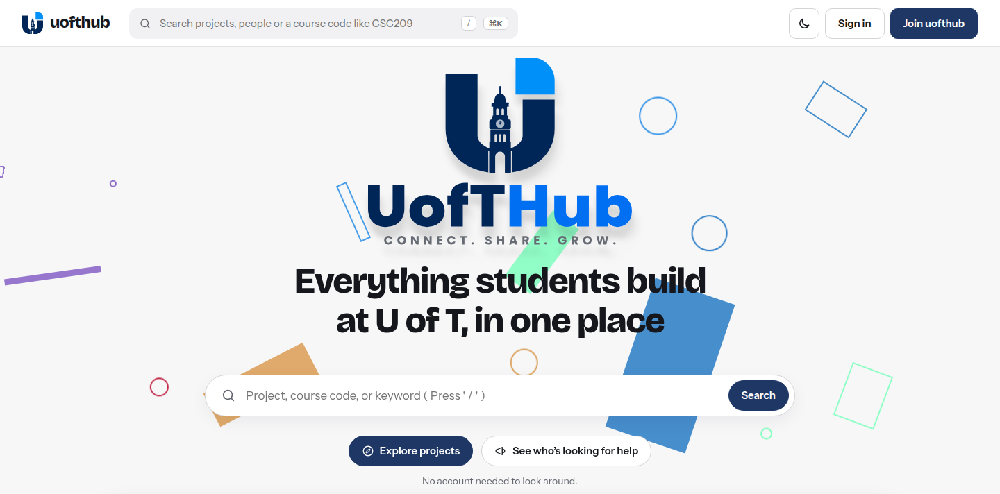

# uofthub

An open-source platform where University of Toronto students can create, showcase, and share what they build — course projects, research, startups, hackathon work, club projects, and personal side projects.

**Website:** [uofthub.com](https://uofthub.com) · **Status:** Early development · **License:** [AGPL-3.0](LICENSE)



---

## What is uofthub?

Student work at U of T is scattered across GitHub, Google Drive, Discord, Canvas, and personal websites. There's no single place to publish and discover what students actually build during their time at university — especially for students outside of CS who don't naturally reach for GitHub.

uofthub is a social layer for student-made work. Upload your project, link your GitHub repo, add collaborators, and share it with however much of the world you want. Think of it as a living portfolio generated from your actual university experience.

**Not:** an official U of T platform, a Canvas competitor, or a grading tool.  
**Yes:** an open-source community project that any U of T student can use and contribute to.

---

## Features

- **Projects** — a title, a one-line pitch and whatever else the work needs: an overview, optional sections (motivation, method, results…), short details, the course it was made for, tags, files, links and collaborators. Anything left empty doesn't render. A project can lead with what it produced (a poster, paper, video, demo…) and record what it drew on (datasets, papers, software), linking to other projects that used the same thing. Made and edited on one page, published last; can start from a GitHub repo or any link. See [structured-projects.md](docs/structured-projects.md)
- **Visibility** — Draft / U of T / Public / Unlisted, defaulting to Draft, plus an optional show-from date that keeps course work hidden until after grading
- **Profiles** — name, faculty, campus, program, year, courses, "Open to" and personal links; pinned projects above the rest
- **Discovery** — Explore (search and filter by faculty, course, type, campus or topic), a feed at `/feed` with Following, Campus and Your program tabs, this week's trending, a weekly spotlight, Looking for help, collections, and AI search at `/discover`
- **Collaboration** — invite collaborators by their U of T email; they edit the project with you once they accept, and anyone not on uofthub yet is emailed to join
- **Social** — three reactions (Impressive, Want to collab, Learned something), private saves, follows (of people and of a project's updates), threaded comments you can edit and delete, versions with update notes that can be viewed and restored, and one-to-one messages; block and report
- **Clubs & labs** — group pages with events, created by moderators; students ask to join or accept an invitation; projects credit the groups they were built with
- **Accounts** — every account confirms its U of T address; password reset, sign out everywhere, email notifications for what needs an answer (one-click unsubscribe), push notifications on any device that turns them on, data export and account deletion at `/settings`
- **Moderation** — reports on projects, comments, collections, profiles, group events and conversations, reviewed at `/admin`, with account suspension; uploaded images checked for nudity by a self-hosted NudeNet scanner (`scanner/`); everyone agrees to the Terms before posting

The web app works on phones (bottom bar, compact header) and in dark mode, with a ⌘K command palette on desktop.

See [ROADMAP.md](docs/ROADMAP.md) for Phase 2 and beyond, and [future.md](docs/future.md) for ideas still being weighed and features parked for later.

---

## Privacy & IP

Your work stays yours. The platform does not claim any rights to uploaded content. Visibility defaults to private and is always student-controlled. Nobody sees a draft unless its owner invites them.

The live pages are `/terms` (ownership, acceptable use, how moderation works) and `/privacy` (what is collected, and which third parties see any of it). The design behind them is [docs/prd.md](docs/prd.md) §9.

---

## Tech Stack

A pnpm workspace with two apps and one shared package, plus a small Python service.

| | |
|---|---|
| **Web** (`web`) | React 19 + Vite, React Router 7, TanStack Query. Tailwind CSS v4 for styling. The design system from the redesign (see [docs/redesign.md](docs/redesign.md)) — tokens as a Tailwind `@theme` in `src/index.css`, primitives in `src/components/ui`, cards in `src/components/project` |
| **API** (`api`) | Fastify 5 on Node 22, Prisma + PostgreSQL, JWT sessions in HTTP-only cookies |
| **Shared** (`packages/types`) | Types crossing the API boundary |
| **Scanner** (`scanner`) | Python, FastAPI + NudeNet — checks uploaded images for nudity; a free Render instance the API wakes as needed |
| **Storage** | Cloudflare R2 (S3-compatible), private bucket — every download goes through a visibility check and a signed URL |
| **Auth** | Microsoft OAuth, or email + password with the address confirmed by email — U of T addresses only (any `utoronto.ca` or `toronto.edu` domain) |
| **Email** | Resend (required in production: sign-up confirmation and password reset) · **AI search** OpenAI — degrades to keyword search when its key is unset |
| **Tests / CI** | Vitest against a real Postgres, GitHub Actions on every PR |

Every decision above, with the reasoning: [docs/ARCHITECTURE.md](docs/ARCHITECTURE.md).

---

## Development

### Prerequisites

- Node 22+ and pnpm 10 (`corepack enable` picks up the pinned version)
- Docker, for the local PostgreSQL

### Getting started

```bash
git clone https://github.com/uofthub/uofthub.git
cd uofthub
pnpm install

docker compose up -d                   # Postgres on :5433, S3 mock on :9090
cp api/.env.example api/.env # works as-is; set a real JWT_SECRET
cp web/.env.example web/.env
pnpm --filter @uofthub/api db:generate

pnpm dev                               # API on :3001, web on :5173
```

`pnpm dev` applies any pending migrations before the API starts, and the API reads `api/.env` itself. The copied `.env` works as-is against the compose services — database and file uploads included (files go to a local S3 mock on :9090). Postgres is on **5433** so it can sit beside a Postgres already installed on the machine.

Sign up with email + password locally: Microsoft OAuth needs real credentials. With no Resend key, the link that confirms your address is printed in the API's console — open it to finish signing up. **Every other integration is optional** — with no keys, email no-ops with a warning, AI search falls back to keyword search, and uploaded images queue unscanned (to run the scanner locally, see the end of `api/.env.example`).

If `docker compose` says *permission denied* on `/var/run/docker.sock`, your user can't reach the Docker daemon yet — run it once with `sudo`, or add yourself to the `docker` group.

### The commands CI runs

```bash
pnpm typecheck
pnpm --filter @uofthub/api test   # needs the Postgres above running
pnpm --filter @uofthub/web test
pnpm build
pnpm lint
```

The API tests create their own `_test` database and refuse to run against any database whose name doesn't end that way — see [docs/CONTRIBUTING.md](docs/CONTRIBUTING.md).

### Where things are

| Path | |
|---|---|
| `api/src/routes` | HTTP surface — auth, projects, users, feed, courses, collections, messages, orgs, spotlight, discover, admin |
| `api/src/lib` | The rules: visibility, project content, search, trending, notifications, storage, link import |
| `api/prisma/schema.prisma` | The data model |
| `scanner/` | The image scanner the API calls — see [architecture § image scanning](docs/ARCHITECTURE.md#image-scanning) |
| `web/src/App.tsx` | Every route in the web app |
| `web/src/pages` | One folder per area (home, explore, project, editor, profile, messages, admin…) |
| `web/src/components` | `ui` primitives, `project` cards, `shell` (header, phone chrome, command palette) |
| `docs/` | [Roadmap](docs/ROADMAP.md), [architecture](docs/ARCHITECTURE.md), [PRD](docs/prd.md), [redesign](docs/redesign.md), [structured projects](docs/structured-projects.md), [student groups](docs/student-groups.md), [future](docs/future.md) |

---

## Contributing

Contributions are welcome — please read [CONTRIBUTING.md](docs/CONTRIBUTING.md) before opening a PR. New here? Start with an issue labelled [good first issue](https://github.com/uofthub/uofthub/labels/good%20first%20issue). Anything touching auth, uploads, visibility or user data should say so in the PR description.

---

## Security

uofthub handles student sign-ins and data. Please **don't** open a public issue for a vulnerability — report it privately as described in [SECURITY.md](SECURITY.md).

---

## License

uofthub is free software, licensed under the [GNU Affero General Public License v3.0 or later](LICENSE) (AGPL-3.0-or-later). Copyright © 2026 Renfred Alonge and the uofthub contributors.

You can use, study, change and share it. If you run a modified version as a service people use over a network, you must offer them its source code under the same license — so improvements to uofthub stay open.

This does not affect your own work: projects, files and everything else students publish on uofthub stay theirs, as [/terms](docs/prd.md) sets out. The license covers this codebase only.
